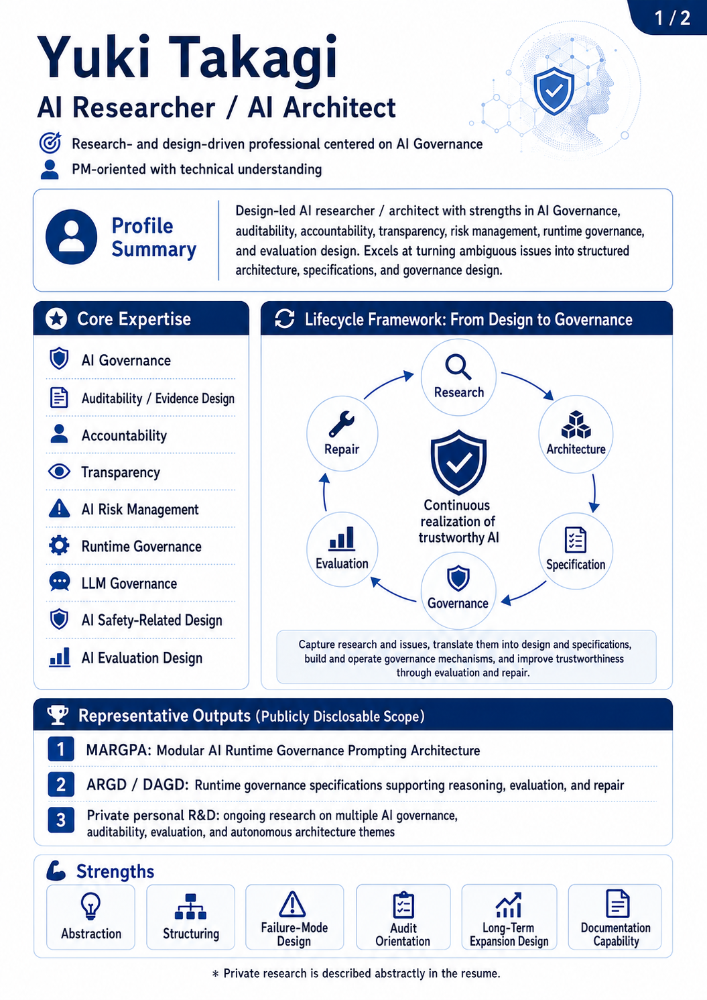
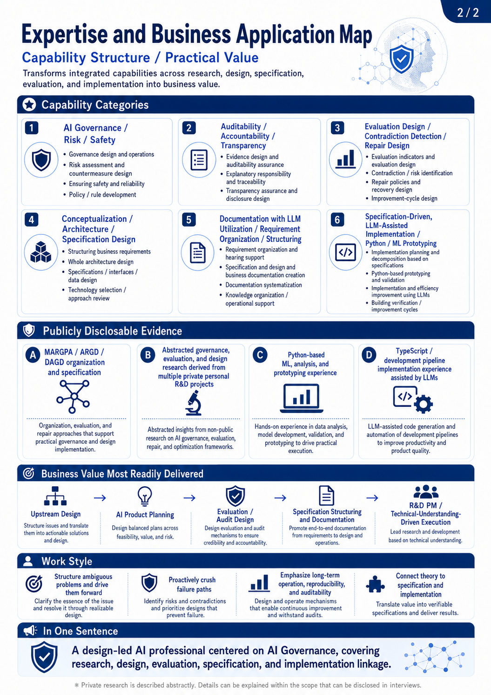
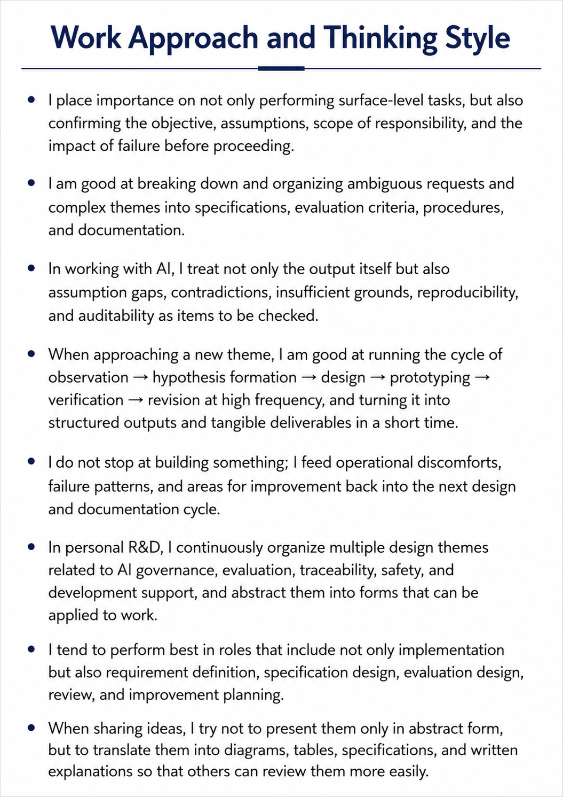

# Resume

Name: Yuki Takagi / 高木 勇輝　　Last Updated: 2026-06-15

* GitHub (Root): [https://github.com/nazuna-2371](https://github.com/nazuna-2371)
* LinkedIn: [https://www.linkedin.com/in/yuki-takagi-34a511389](https://www.linkedin.com/in/yuki-takagi-34a511389)

> This document has been structured and diagrammed with auxiliary use of LLMs, based on my practical work experience and personal R&D. I have reviewed the content, and I am responsible for its final accuracy and presentation.

---

## 1. Overview

This page summarizes my areas of strength, centered on AI Governance / Auditability / LLM Evaluation Design,
currently publicly shareable representative work, and work related strengths.

The images below are analysis results based on my practical work experience and personal R&D.
For currently non public personal R&D and each system, research names and detailed structures are not disclosed.
Instead, they are abstracted into capability categories that can be explained in a resume.

> Some diagram text and text embedded in images may appear small when viewed at reduced scale in the PDF.  
> If needed, please zoom in on the PDF, or refer to the GitHub Markdown version of the resume / individual image files.  
> You can also click each image to open the corresponding image on GitHub.

* Resume:  
  [https://github.com/nazuna-2371/resume/](https://github.com/nazuna-2371/resume/)

### 1.1 Profile Summary

---

## 2. Publicly Available Related Materials

* MARGPA: Modular AI Runtime Governance Prompting Architecture  
  [https://github.com/nazuna-2371/margpa/](https://github.com/nazuna-2371/margpa/)

> MARGPA is an AI Runtime Governance design for governing LLM reasoning, context preservation, premise fixation, contradiction handling, self repair, and related behaviors at runtime.
> Its purpose is to treat AI output quality and reliability not merely as prompt design issues, but as structures that can be evaluated, audited, and repaired.

MARGPA is an individual repository for viewing my currently publicly available representative work.

---

## 3. Analysis Procedure and Evaluation Design

The diagrams and body text in this resume were organized and analyzed from perspectives such as AI Governance / Auditability / LLM Evaluation Design, based on my practical work experience, thinking tendencies, publicly shareable research outputs, currently non public personal R&D, and each system.

The analysis procedure, evaluation perspectives, and compression policy used for this resume are organized in the following materials.

* Analysis Procedure and Evaluation Design for Capabilities and Skills in Resume Preparation:  
  [docs/resume_analysis_methodology_en.md](https://github.com/nazuna-2371/resume/blob/main/docs/resume_analysis_methodology_en.md)

---

## 4. Capability Structure and Business Application Map

---

## 5. Overview of Personal R&D

The period from leaving my previous position to the present is positioned not simply as a period of non employment, but as a period of personal R&D centered on AI governance, LLM evaluation, audit trail design, safety, and development support.
During this period, I have continuously worked on multiple research themes and AI system designs, and have organized them into capability categories that can be applied in professional work.

I conduct personal R&D on multiple AI system designs, evaluation designs, and LLM based prototyping, focusing on the output quality, runtime behavior, audit trails, auditability, safety, context continuity, and human AI interaction of LLMs and AI systems.

The main research objective is to treat AI not merely as an output generation tool, but as a system that can be designed, evaluated, and operated from the following perspectives.

* Whether it is possible to verify which premises, context, and judgment process an AI output was based on
* Treating LLM contradictions, premise deviation, insufficient grounding, overgeneralization, and context loss as evaluation targets
* Designing responsibility boundaries, human confirmation points, exception handling, and repair paths in AI utilization
* Treating dialogue history and judgment grounds as audit trails that can be verified later
* Designing audit trails with tamper resistance and auditability in mind
* Observing and adjusting runtime behavior, including the side effects of AI Safety mechanisms and guardrails
* Handling not only normal processing, but also deviation, failure, re evaluation, and repair through exception aware design
* Maintaining responsibility boundaries and auditability in distributed environments involving multiple AIs, agents, tools, and users
* Treating how AI can support human learning, creativity, expression, and decision making as a design target
* Reconstructing the flow of development, specification design, documentation, evaluation, and improvement with AI support

As currently publicly shareable representative examples, I have published materials such as MARGPA / ARGD / DAGD, which address LLM reasoning, context preservation, premise fixation, contradiction handling, self repair, and runtime governance.

In addition, as currently non public personal R&D and systems, I have also conducted LLM based prototyping related to dialogue audit trails and context continuity, distributed AI governance, exception aware safety design, tamper resistant audit trail design, and AI assisted development reconstruction and specification support.

In this resume, these are abstracted into the following capability categories rather than being described as individual research names or detailed internal structures.

* AI Governance
* Auditability
* Tamper resistance and audit trail design
* AI Accountability
* AI Transparency
* AI Risk Management
* LLM Evaluation Design
* Runtime Governance
* AI Safety Governance
* Distributed AI governance design
* exception aware safety and repair design
* Dialogue context continuity design
* LLM assisted prototyping
* AI assisted development support
* Specification design / Documentation design
* human AI interaction and capability extension
* Multimodal information and expressive data structuring

These are not merely a list of theories or ideas.
They are personal R&D efforts to treat AI failure, deviation, misunderstanding, responsibility boundaries, and repairability as design targets, and to organize them into forms that can be applied in professional work.

---

## 6. Professional Summary

I have experience in data management, AI/ML PoC support, Python based data collection and automation, and web / internal tool development.

Most recently, I worked on a Responsible AI team in a generative AI / LLM model development project.

In that role, I handled harmful content definition and taxonomy editing, training data quality management, review operations, knowledge management, and information restructuring / workflow efficiency improvement using ChatGPT.

I tend to perform well in work that requires organizing ambiguous requirements, data definitions, and operational judgment criteria, then translating them into procedures, documents, evaluation perspectives, and improvement proposals.

---

## 7. Work Experience Overview

| Period | Company / Contract Type | Area |
|---|---|---|
| Apr 2025 – Sep 2025 | PERSOL CROSS TECHNOLOGY CO., LTD. / Temporary staffing contract | Responsible AI / Data Management |
| Feb 2024 – Jul 2024 | PERSOL CROSS TECHNOLOGY CO., LTD. / Temporary staffing contract | Web Scraping / Training Data Collection |
| Apr 2021 – Jul 2022 | Toyo Integration Co., Ltd. / SES contract | Data Science Assistant / AutoML PoC Support |
| Dec 2019 – Jan 2021 | Beagle Inc. / Part time | Web Production / Internal Tool Development |

---

## 8. Work Experience Details

### 8.1 Responsible AI / Data Management

| Item | Details |
|---|---|
| Period | Apr 2025 – Sep 2025 |
| Company / Contract Type | PERSOL CROSS TECHNOLOGY CO., LTD. / Temporary staffing contract |
| Client | Major generative AI / LLM model development company |
| Area / Role | Responsible AI team member / Data Management |
| Main Responsibilities | Edited, created, and added harmful content definitions and classification taxonomies Managed, reviewed, and provided feedback on training data quality Reviewed and guided writing, red teaming, and labeling work Facilitated safety meetings and handled questions / consultations Organized and managed information using Google Sheets, Confluence, and related tools Managed access permissions Created output text for uncensored training data |
| Improvements / Contributions | Restructured information and improved workflow efficiency using ChatGPT Prepared definition tables, Confluence resources, and operational documents |
| Tools / Environment | macOS Google Sheets Confluence ChatGPT 4o / ChatGPT 5.0 Auto |

### 8.2 Web Scraping / Training Data Collection

| Item | Details |
|---|---|
| Period | Feb 2024 – Jul 2024 |
| Company / Contract Type | PERSOL CROSS TECHNOLOGY CO., LTD. / Temporary staffing contract |
| Client | Major generative AI development company |
| Area / Role | Web Scraping Engineer |
| Main Responsibilities | Collected training corpora for AI based machine translation model development and model upgrades Maintained existing scraping scripts Investigated and fixed scraping processes affected by website structure changes Researched new target websites and created scraping scripts Researched and listed candidate websites for corpus collection Created crawling scripts and improved scheduled data collection processes |
| Improvements / Contributions | Improved adaptability to website structure changes Improved data collection efficiency |
| Tools / Environment | macOS / Linux / AWS Linux Python 3 BeautifulSoup4 Selenium cron Jupyter Notebook Visual Studio Code / Excel |

### 8.3 Data Science Assistant / AutoML PoC Support

| Item | Details |
|---|---|
| Period | Apr 2021 – Jul 2022 |
| Company / Contract Type | Toyo Integration Co., Ltd. / SES contract |
| Client | Data Science Department of a major company |
| Area / Role | Data Science Assistant |
| Main Responsibilities | Supported analysis and PoC work using AutoML tools Assisted with regression analysis projects such as material price prediction, demand forecasting, and profit prediction Handled data cleansing, data processing, RDS database operations, analysis tasks, and report preparation Used Excel to calculate, visualize, and check consistency of analysis result data Created and revised training materials Reviewed training curricula, identified issues, and created sample data |
| Improvements / Contributions | Created a Python based SQL generation tool to improve SQL creation efficiency Implemented SQL generation logic that branches column definitions and type handling based on CSV header information Added verification perspectives such as RMSE, R², and correlation coefficient checks Identified unclear parts in training materials and exercise questions, and proposed wording revisions |
| Tools / Environment | Windows 10 / CentOS 7 Python 3 PostgreSQL AutoML Tool AWS RDS Jupyter Notebook WinSCP / Excel |

### 8.4 Web Production / Internal Tool Development

| Item | Details |
|---|---|
| Period | Dec 2019 – Jan 2021 |
| Company / Contract Type | Beagle Inc. / Part time |
| Area / Role | Web Creator / Internal Tool Development |
| Main Responsibilities | Produced websites Created an internal training portal site Published and organized training curricula, exercises, and reference materials Created administrator pages, member skill evaluation pages, and shared pages Studied PHP, Python, MySQL, and related technologies outside working hours and applied them to internal tool development |
| Improvements / Contributions | Used technologies learned outside working hours to improve and extend internal tools |
| Tools / Environment | Windows HTML / CSS / SCSS JavaScript / jQuery / TypeScript PHP / Python MySQL |

---

## 9. Skills

### 9.1 Data / AI

* Data preprocessing
* Data cleansing
* Exploratory data analysis (EDA)
* AutoML / AI / ML PoC support
* Data quality management
* Responsible AI
* Labeling / taxonomy definition
* LLM utilization support

### 9.2 Programming / Database

* Python 3
* SQL
* PostgreSQL
* JavaScript
* PHP
* HTML5
* CSS3 / SCSS

### 9.3 Automation / Scraping

* BeautifulSoup4
* Selenium
* cron
* Jupyter Notebook
* Python based operational support tool development
* SQL generation support tool development

### 9.4 Tools / Platforms

* AWS
* AWS RDS
* Linux / CentOS
* macOS
* Windows
* Google Workspace
* Google Sheets
* Confluence
* Git / GitHub
* Visual Studio Code
* AutoML Tool

### 9.5 Documentation / Operation

* Operational procedure organization
* Documentation
* Training material creation
* Knowledge management
* Access permission management
* Review / feedback
* Workflow improvement

---

## 10. Certifications

### 10.1 Information Technology

* Fundamental Information Technology Engineer Examination
* Information Security Management Examination
* IT Passport Examination

### 10.2 Programming / Development

* Python 3 Certified Engineer Data Analysis Examination
* Python 3 Certified Engineer Basic Examination
* Oracle Java Bronze SE
* PHP 7 Engineer Certification Basic Level
* Excel VBA Standard

### 10.3 Database

* OSS-DB Silver

### 10.4 AI / Machine Learning / Statistics

* JDLA Deep Learning for GENERAL (G Test)
* Data Scientist Certification
* Statistics Certification Grade 3
* Business Statistics Specialist: Excel Analysis Basic
* AI Implementation Certification Grade B

### 10.5 Cloud

* AWS Certified Cloud Practitioner

---

## 11. Career Map

At present, I would like to deepen my experience mainly in roles close to an AI Researcher in the LLM domain and an AI Governance & Safety Architect.

Based on my experience in data management, workflow improvement, and AI utilization support, I focus on areas connected to AI Governance / AI Safety / LLM evaluation design / specification and documentation design. In practical work, I tend to perform well in roles that require breaking down ambiguous issues into requirements, evaluation criteria, and procedures, and organizing them into an improvable form.

---

## 12. Future Learning Topics

At present, I mainly work with technical document reading and document drafting by using translation tools.

Going forward, I plan to improve the accuracy of my technical document reading and strengthen the English communication skills required in practical work.

---

## 13. Work Style and Thinking Style

