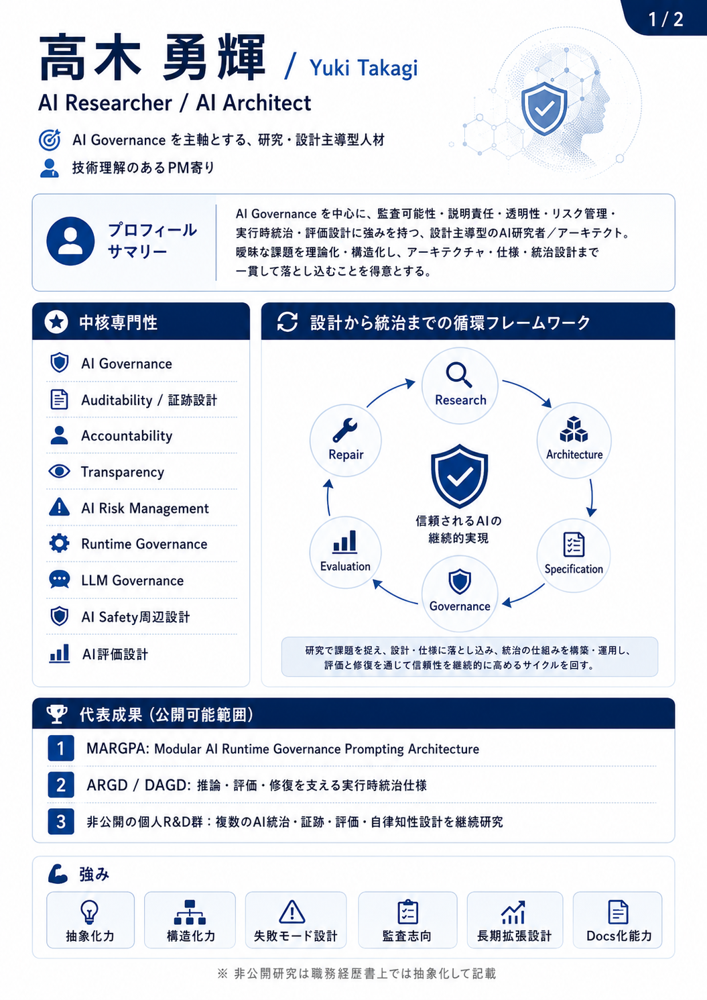
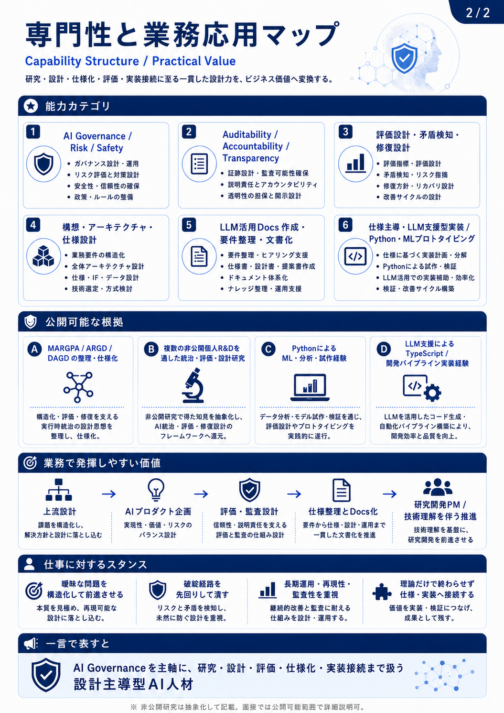
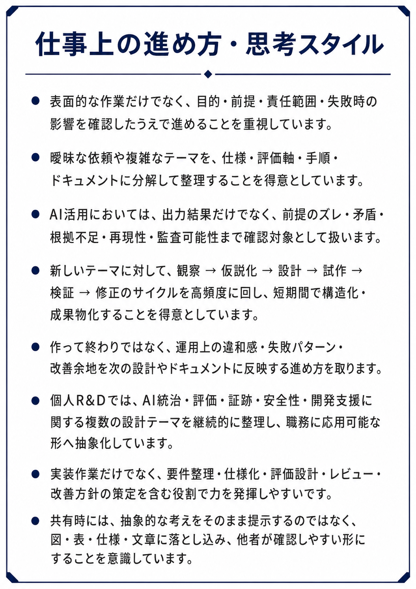

# 職務経歴書

氏名: 高木 勇輝 / Yuki Takagi　　更新日: 2026-06-15

* GitHub（ルート）: [https://github.com/nazuna-2371](https://github.com/nazuna-2371)
* LinkedIn: [https://www.linkedin.com/in/yuki-takagi-34a511389](https://www.linkedin.com/in/yuki-takagi-34a511389)

> 本書は、私の実務経験および個人R&Dの内容を基に、LLMを補助的に使用して構成・図式化しています。記載内容の確認および最終責任は私にあります。

---

## 1. 概要

AI Governance / Auditability / LLM評価設計などを中心とした得意領域軸、
現時点での公開可能な代表成果、職務上の強みを要約したページです。

下記画像は、今までの実務経験及び個人R&Dの内容からの分析結果です。
現時点では非公開の個人R&D、各システムについては、研究名・詳細構成を出さず、
職務経歴書上で説明可能な能力カテゴリへ抽象化して記載しています。

> PDF内の図版・画像内テキストは縮小表示では一部文字が小さく見える場合があります。  
> 必要に応じてPDFを拡大するか、GitHubのMarkdown版の職務経歴書 / 画像ファイルを参照してください。  
> 画像クリックでも、GitHubの同画像を参照できます。

* Resume:  
  [https://github.com/nazuna-2371/resume/](https://github.com/nazuna-2371/resume/)

### 1.1 プロフィールサマリー

---

## 2. 公開中の関連資料

* MARGPA: Modular AI Runtime Governance Prompting Architecture  
  [https://github.com/nazuna-2371/margpa/](https://github.com/nazuna-2371/margpa/)

> MARGPAは、LLMの推論・文脈保持・前提固定・矛盾処理・自己修復などを、実行時に統治するためのAI Runtime Governance設計です。  
> AIの出力品質と信頼性を、プロンプト設計だけでなく、評価・監査・修復可能な構造として扱うことを目的としています。

MARGPAは、現時点での公開中の代表成果を見るための個別リポジトリです。

---

## 3. 分析手順・評価設計について

本職務経歴書の図式化資料および本文表現は、私の実務経験、思考の傾向、公開可能な研究成果、現時点では非公開の個人R&D、各システムを対象に、AI Governance / Auditability / LLM評価設計などの観点から整理・分析しています。

分析に用いた手順、評価観点、圧縮方針については、下記資料に整理しています。

* 職務経歴書作成における能力・スキルの分析手順・評価設計:  
  [docs/resume_analysis_methodology_ja.md](https://github.com/nazuna-2371/resume/blob/main/docs/resume_analysis_methodology_ja.md)  
  [docs/resume_analysis_methodology_en.md](https://github.com/nazuna-2371/resume/blob/main/docs/resume_analysis_methodology_en.md)

---

## 4. 能力構造・業務応用マップ

---

## 5. 個人R&Dの概要

前職退職後から現在までの期間は、単なる未就業期間ではなく、AI統治・LLM評価・証跡設計・安全性・開発支援を中心とした個人R&D期間として位置づけています。
この期間に、複数の研究テーマおよびAIシステム設計を継続的に行い、職務上応用可能な能力カテゴリとして整理しています。

私は、LLM / AI の出力品質、実行時挙動、証跡、監査可能性、安全性、文脈継承、人間との相互作用を対象に、個人R&Dとして複数のAIシステム設計・評価設計・LLM活用プロトタイピングを行っています。

主な研究対象は、AIを単なる出力生成ツールとして扱うのではなく、以下のような観点から設計・評価・運用可能な対象として捉えることです。

* AIの出力が、どの前提・文脈・判断過程に基づいて生成されたかを確認できること
* LLMの矛盾、前提逸脱、根拠不足、過剰一般化、文脈喪失を評価対象として扱うこと
* AI利用時の責任範囲、人間の確認ポイント、例外処理、修復経路を設計すること
* 対話履歴や判断根拠を、後から検証可能な証跡として扱うこと
* 改竄耐性や監査可能性を意識した証跡設計を行うこと
* AI Safetyやガードレールの副作用も含めて、実行時の挙動を観察・調整すること
* 例外認識型の設計により、通常処理だけでなく逸脱・失敗・再評価・修復を扱うこと
* 複数AI、エージェント、ツール、ユーザーが関与する分散型環境で、責任境界と監査可能性を保つこと
* 人間の学習、創造性、表現、意思決定をAIがどのように支援できるかを設計対象として扱うこと
* AI支援による開発、仕様化、ドキュメント化、評価、改善の流れを再構成すること

現在公開可能な代表例として、MARGPA / ARGD / DAGD など、LLMの推論・文脈保持・前提固定・矛盾処理・自己修復・実行時ガバナンスを扱う資料を公開しています。

また、現時点では非公開の個人R&D、各システムとして、対話証跡・文脈継承、分散型AI統治、例外認識型安全設計、改竄耐性を意識した証跡設計、AI支援による開発再構成・仕様化支援などに関するLLM活用プロトタイピングも行っています。

職務経歴書上では、これらを個別の研究名や詳細構成としてではなく、以下のような能力カテゴリへ抽象化しています。

* AI Governance
* Auditability
* Tamper resistance and audit trail design
* AI Accountability
* AI Transparency
* AI Risk Management
* LLM Evaluation Design
* Runtime Governance
* AI Safety Governance
* Distributed AI governance design
* Exception-aware safety and repair design
* Dialogue context continuity design
* LLM-assisted prototyping
* AI-assisted development support
* Specification design / Documentation design
* Human-AI interaction and capability extension
* Multimodal information and expressive data structuring

これらは、単に理論やアイデアを列挙するものではなく、AIの失敗・逸脱・誤解・責任境界・修復可能性を設計対象として扱い、職務上応用可能な形へ整理するための個人R&Dです。

---

## 6. 職務要約

データマネジメント、AI/ML PoC支援、Pythonによるデータ収集・自動化、Web / 内部ツール開発を経験しています。

直近では、生成AI・LLMモデル開発系プロジェクトのResponsible AIチームにおいて、

有害性定義・分類定義の編集、学習用データの品質管理、レビュー、ナレッジ管理、ChatGPTを用いた情報再整理、業務効率化を担当しました。

曖昧な要件、データ定義、業務上の判断基準を整理し、手順・資料・評価観点・改善案へ落とし込む業務で力を発揮しやすいです。

---

## 7. 職務経歴一覧

| 期間 | 所属 / 契約形態 | 業務領域 |
|---|---|---|
| 2025年4月 ～ 2025年9月 | パーソルクロステクノロジー株式会社 / 派遣契約 | Responsible AI / データマネジメント |
| 2024年2月 ～ 2024年7月 | パーソルクロステクノロジー株式会社 / 派遣契約 | Webスクレイピング / 学習用データ収集 |
| 2021年4月 ～ 2022年7月 | 東洋インテグレーション株式会社 / SES | データサイエンスアシスタント / AutoML PoC支援 |
| 2019年12月 ～ 2021年1月 | 株式会社ビーグル / アルバイト | Web制作 / 内部ツール開発 |

---

## 8. 職務経歴詳細

### 8.1 Responsible AI / データマネジメント

| 項目 | 内容 |
|---|---|
| 期間 | 2025年4月 ～ 2025年9月 |
| 所属 / 契約形態 | パーソルクロステクノロジー株式会社 / 派遣契約 |
| 派遣先 | 某大手 生成AI・LLMモデル開発系企業 |
| 領域 / 役割 | Responsible AIチームメンバー / データマネジメント |
| 主な業務 | 有害性定義・分類定義の編集、作成、追加 学習用データの品質管理、レビュー、フィードバック 文章、レッドチーミング、ラベリングに関するレビュー・指導 安全性ミーティングでのファシリテーション、質問・相談対応 Googleスプレッドシート、Confluence等による情報整理・管理 アクセス権限管理 Uncensored学習用出力文の作成 |
| 工夫・改善 | ChatGPTを用いた情報再整理、業務効率化 定義表、Confluence上の情報資源、業務用ドキュメントの整備 |
| 使用技術・環境 | macOS Googleスプレッドシート Confluence ChatGPT 4o / ChatGPT 5.0 Auto |

### 8.2 Webスクレイピング / 学習用データ収集

| 項目 | 内容 |
|---|---|
| 期間 | 2024年2月 ～ 2024年7月 |
| 所属 / 契約形態 | パーソルクロステクノロジー株式会社 / 派遣契約 |
| 派遣先 | 某大手 生成AI開発系企業 |
| 領域 / 役割 | スクレイピングエンジニア |
| 主な業務 | AI文章翻訳機の開発・モデルアップグレードに向けた学習用コーパス収集 既存スクリプトの保守 サイト構造変更に伴うスクレイピング処理の調査、修正 新規対象サイトの調査、スクレイピングスクリプト作成 コーパス取得候補サイトの調査、一覧化 クロールスクリプト作成、定期取得処理の改善 |
| 工夫・改善 | サイト構造変更への追従性向上 取得効率の改善 |
| 使用技術・環境 | macOS / Linux / AWS Linux Python 3 BeautifulSoup4 Selenium cron Jupyter Notebook Visual Studio Code / Excel |

### 8.3 データサイエンスアシスタント / AutoML PoC支援

| 項目 | 内容 |
|---|---|
| 期間 | 2021年4月 ～ 2022年7月 |
| 所属 / 契約形態 | 東洋インテグレーション株式会社 / SES |
| 派遣先 | 某大手企業内 データサイエンス部 |
| 領域 / 役割 | データサイエンスアシスタント |
| 主な業務 | AutoMLツールを用いた分析代行、PoC支援 材料価格、需要予測、利益額予測などの回帰系分析案件の補助 データクレンジング、加工、RDS DB操作、分析作業、報告資料作成 分析結果データをもとにしたExcelでの計算、グラフ化、整合性確認 教育資料の作成、改訂 教育カリキュラムの見直し、課題洗い出し、サンプルデータ作成 |
| 工夫・改善 | Python製SQL生成ツールを作成し、SQL作成作業を効率化 CSVヘッダー情報をもとにカラム定義や型処理を分岐させるSQL生成処理を作成 RMSE、R²、相関係数などの確認観点を追加 教育資料・問題文の分かりにくい箇所を洗い出し、文言修正を提案 |
| 使用技術・環境 | Windows 10 / CentOS 7 Python 3 PostgreSQL AutoML Tool AWS RDS Jupyter Notebook WinSCP / Excel |

### 8.4 Web制作 / 内部ツール開発

| 項目 | 内容 |
|---|---|
| 期間 | 2019年12月 ～ 2021年1月 |
| 所属 / 契約形態 | 株式会社ビーグル / アルバイト |
| 領域 / 役割 | Webクリエイター / 内部ツール開発 |
| 主な業務 | Webサイト制作 社内教育ポータルサイトの作成 教育カリキュラム、練習問題、参考資料の掲載・整理 管理者向けページ、メンバースキル評価、共有ページの作成 PHP、Python、MySQL等を学習し、内部ツール開発へ応用 |
| 工夫・改善 | 業務後に学習した技術を活用し、内部ツールの改善・拡張を実施 |
| 使用技術・環境 | Windows HTML / CSS / SCSS JavaScript / jQuery / TypeScript PHP / Python MySQL |

---

## 9. スキル

### 9.1 Data / AI

* データ前処理
* データクレンジング
* 探索的データ分析（EDA）
* AutoML / AI・ML PoC支援
* データ品質管理
* Responsible AI
* ラベリング / 分類定義
* LLM活用支援

### 9.2 Programming / Database

* Python 3
* SQL
* PostgreSQL
* JavaScript
* PHP
* HTML5
* CSS3 / SCSS

### 9.3 Automation / Scraping

* BeautifulSoup4
* Selenium
* cron
* Jupyter Notebook
* Pythonによる業務補助ツール作成
* SQL生成支援ツール作成

### 9.4 Tools / Platforms

* AWS
* AWS RDS
* Linux / CentOS
* macOS
* Windows
* Google Workspace
* Google スプレッドシート
* Confluence
* Git / GitHub
* Visual Studio Code
* AutoML Tool

### 9.5 Documentation / Operation

* 業務手順整理
* ドキュメント整備
* 教育資料作成
* ナレッジ管理
* アクセス権限管理
* レビュー / フィードバック
* 業務改善

---

## 10. 保有資格

### 10.1 情報処理

* 基本情報技術者
* 情報セキュリティマネジメント
* ITパスポート

### 10.2 言語・開発

* Python 3 エンジニア認定データ分析
* Python 3 エンジニア認定基礎
* Oracle Java Bronze SE
* PHP7 技術者認定 初級
* Excel VBA スタンダード

### 10.3 データベース

* OSS-DB Silver

### 10.4 AI / 機械学習 / 統計

* JDLA Deep Learning for GENERAL（G検定）
* データサイエンティスト検定
* 統計検定 3級
* ビジネス統計スペシャリスト エクセル分析ベーシック
* AI実装検定 B級

### 10.5 クラウド

* AWS Certified Cloud Practitioner

---

## 11. キャリアマップ

現状では、主にLLM領域のAI Researcher、およびAI Governance & Safety Architectに近い役割で経験を深めたいと考えています。

データマネジメント、業務改善、AI活用支援を基盤に、AI Governance / AI Safety / LLM評価設計 / 仕様化・ドキュメント化へ接続する領域を主軸としています。実務上は、曖昧な課題を要件・評価軸・手順へ分解し、改善可能な形に整理する役割で力を発揮しやすいです。

---

## 12. 今後の学習課題

現在は、翻訳ツールを併用した技術文書の読解・文書作成を中心に対応しています。

今後は、技術文書の読解精度向上と、実務上必要な英語コミュニケーション力の強化を学習課題としています。

---

## 13. 仕事上の進め方・思考スタイル

